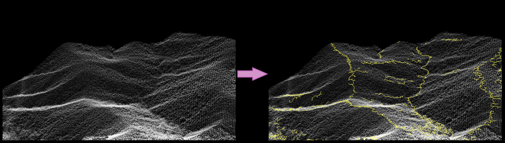

# Projection-based-breakline-extractor
A feature line extractor from terrain point cloud data using projection-based approach. 

This tool was designed for the experiment mentioned in:
[https://doi.org/10.21203/rs.3.rs-4549886/v1]

## Python packages to be installed
* tkinter
* multiprocessing

## Code execution
Open the directory **Code** in an editor like VS Code and run the file named `projection_based_breakline_extractor.py`.
The user manual for this tool can be accessed through the drop-down menu named `Help`.
Additionally, an executable file for Windows systems is available in the **Executable file** directory.

### Metadata
The metadata files, located in the **Metadata** directory, summarise the datasets from OpenTopography which were used to test this tool

### Test data
The test data is located in the **Datasets** directory of the following repository: 
https://doi.org/10.5281/zenodo.11628500
